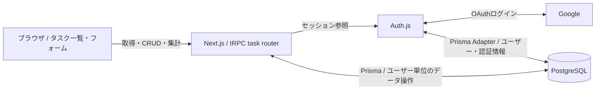

# Rakuraku
タスクの作成・編集・削除、状態・優先度・期限の管理、検索・絞り込み、統計表示を行うWebアプリです。

## 技術構成
Next.js 15 / React 19 / TypeScript / tRPC 11 / Prisma 6 / PostgreSQL / Auth.js（NextAuth v5 beta）/ Tailwind CSS 4 / Playwright / Biome。
- [src/app/_components/tasks](src/app/_components/tasks): タスク一覧・フォーム・フィルター
- [src/server/api/routers/task.ts](src/server/api/routers/task.ts): 入力検証・CRUD・集計
- [prisma/schema.prisma](prisma/schema.prisma): データモデル
- [src/server/auth/config.ts](src/server/auth/config.ts): 認証設定
- [tests/e2e](tests/e2e): E2Eテスト

## システムアーキテクチャ



- 画面からの操作は [TaskList](src/app/_components/tasks/TaskList.tsx) と [task router](src/server/api/routers/task.ts) に対応します。
- [tRPCのコンテキスト・protectedProcedure](src/server/api/trpc.ts) がセッションを扱い、[認証設定](src/server/auth/config.ts) が Google と Prisma Adapter を接続します。
- データ保存は [Prisma Client](src/server/db.ts) と [schema](prisma/schema.prisma) に従います。常駐workerや外部ジョブキューはありません。
- 図は通常の認証経路です。E2E専用DB・モック認証は非本番のテスト環境だけの別経路です。

## セットアップ
Node.js・npm、PostgreSQL、Google OAuthの開発用設定が必要です。
```sh
cp .env.example .env
# DBと認証の設定を入力
npm ci
npm run db:push
npm run dev
```
`http://localhost:3000` を開きます。`db:push` はスキーマを変更するため、専用の開発DBを指定してください。

## 環境変数
[src/env.js](src/env.js) で検証します。
- DATABASE_URL: PostgreSQL接続先
- AUTH_SECRET: セッション用秘密値
- AUTH_GOOGLE_ID / AUTH_GOOGLE_SECRET: Google OAuth
- DATABASE_URL_E2E: 任意のE2E専用DB
- E2E_TEST_MODE: 通常は false。テスト認証は true かつ NODE_ENV が development または test の場合だけ有効です。

## ビルド・テスト
```sh
npm run typecheck
npm run check
npm run build
npm run test:e2e
```
E2Eには専用DBとPlaywrightの対応ブラウザが必要です。テスト用スクリプトはデータを変更するため、本番DBの接続情報を指定しないでください。

Node.js 24で認証ガードだけを確認する場合:
```sh
node --test tests/security/e2e-mode.test.mjs
```
